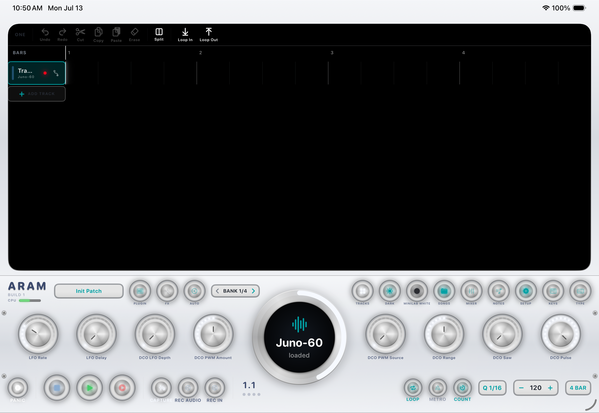
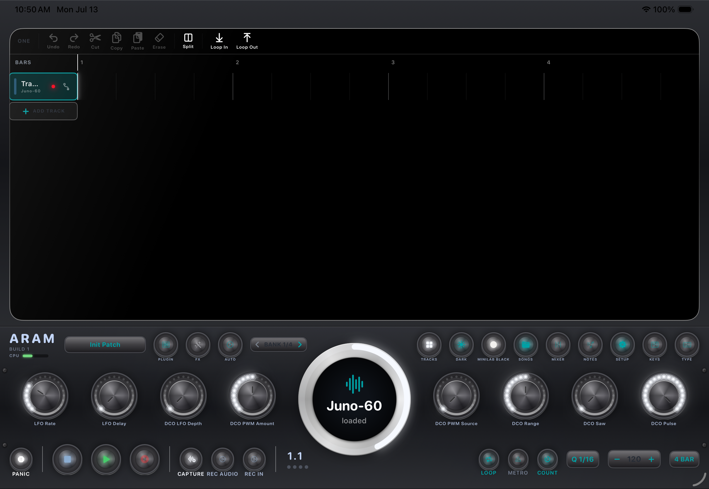

# ARAM — User Manual

**ARAM** (formerly ARAM; project name *AUSeq*) is a native iPad **audio + MIDI DAW and AUv3 plugin host**, designed around hardware MIDI controllers — with first-class support for the Arturia KeyLab mkII 88, **Arturia MiniLab 37**, Korg Keystage, Novation Launchkey Mini, and the PreSonus ioStation 24c. It runs on iPad (best on iPad Pro 11") and iPhone.

> ARAM is a personal project, installed via direct install / OTA — it is not on the App Store.

---

## Contents

1. [The main screen](#1-the-main-screen)
2. [Tracks and sounds](#2-tracks-and-sounds)
3. [The sound browser wheel](#3-the-sound-browser-wheel)
4. [Recording MIDI](#4-recording-midi)
5. [Capture MIDI](#5-capture-midi--the-i-just-played-something-button)
6. [Recording audio](#6-recording-audio)
7. [The arranger](#7-the-arranger)
8. [The piano roll](#8-the-piano-roll)
9. [The mixer](#9-the-mixer)
10. [Pad modes](#10-pad-modes)
11. [Controllers](#11-controllers)
12. [Arturia MiniLab 37](#12-arturia-minilab-37)
13. [Themes and appearance](#13-themes-and-appearance)
14. [Songs](#14-songs)
15. [Configuration and diagnostics](#15-configuration-and-diagnostics)
16. [Keyboard shortcuts](#16-keyboard-shortcuts)
17. [Troubleshooting](#17-troubleshooting)

---

## 1. The main screen

The interface is styled as a piece of studio hardware: a brushed-aluminum faceplate with wood side panels, physical-looking knobs with LED rings, and a dark "OLED" arranger screen.

- **Left/center — the arranger**: a zoomable multi-track timeline showing your MIDI and audio clips, the playhead, and the loop band along the ruler.
- **Right — the control deck**: the big **sound browser wheel**, eight **parameter knobs** with LED rings (they bind to the selected track's instrument), and utility buttons.
- **Bottom — the transport bar**: Panic · Stop · Play · Record · Capture · REC AUDIO · REC IN · quantize tools · tempo.
- **Top bar**: track list, mixer, note editor, songs, pad-mode, theme, dark/light, keys, plugin window, and SETUP.

On iPhone the same engine runs with a compact layout: in landscape the arranger fills the screen with a slim control strip, and the knob deck slides up as an overlay.

## 2. Tracks and sounds

Every track hosts an **AUv3 instrument** (or holds **audio clips** — see [Recording audio](#6-recording-audio)). ARAM ships with two built-in plugins so a fresh install makes sound immediately:

- **Juno-60** — a Roland Juno-60 style synth, auto-loaded on new tracks.
- **Singularity** — a deep-space reverb (Eventide Blackhole-inspired), available as a per-track FX insert.

Any AUv3 instrument or effect installed on the iPad shows up too (AUM/Audiobus-style hosting, out-of-process). Each track has one optional **FX insert** between the instrument and its mixer channel.

- **Add a track**: the + in the track list — or in TRACKS pad mode, just **tap an empty pad**.
- **Select a track**: tap its lane header, or press its pad in TRACKS mode.
- **Per-track controls**: volume, pan, mute, solo, record-arm; a live VU meter glows in each track header.

## 3. The sound browser wheel

The big wheel with the round screen is the sound browser:

- **Drag** the wheel (or turn a controller's encoder) to scroll the instrument list. The plugin's **icon and name** show while you browse.
- **Tap** the wheel (or click the encoder) to **load** the shown sound onto the selected track. The caption under the icon reads **"loaded"** when the wheel is showing what's actually on the track.
- If you browse away and don't load anything, after ~4 seconds the wheel **snaps back** to the loaded sound — like a hardware synth's menu timeout.
- Pressing load on a sound that's already loaded does nothing (it won't reload and wipe your knob tweaks).

## 4. Recording MIDI

1. Select a track (it auto-arms).
2. Press **Record** — the transport starts with a count-in and records what you play (on-screen keys, any MIDI keyboard, drum pads, or the computer keyboard in piano mode).
3. The loop plays back and you can **overdub** on further passes.

**Quantize** lives in the transport bar: auto-quantize on record, apply-to-selection, and re-quantize. The grid (Bar … 1/16T) also sets snapping for clip editing. Recording drums with auto-quantize on won't double-trigger hits — a hit that snaps ahead of the playhead is not replayed in the same pass.

**Parameter automation**: arm **AUTO**, press play, and turn knobs — the moves are recorded and replay on playback. Each track header has a curve menu to view, redraw, or clear a parameter's automation lane.

## 5. Capture MIDI — the "I just played something" button

ARAM is **always listening** (like Ableton Live's Capture): every note you play is kept in a rolling 2-minute buffer, whether or not you were recording.

- Press **CAPTURE** (waveform+ icon) after noodling something good:
  - **From silence** (empty song, stopped): ARAM detects the tempo and bar count, creates the loop, and starts it rolling.
  - **Over a running loop**: your notes are added as an overdub, in time.

## 6. Recording audio

Two audio paths:

- **REC AUDIO** — *bounce the synths*: records every instrument track to per-track WAV stems plus the master mix, and drops the master bounce onto a new audio track at the right beat. Files are browsable under SETUP → Audio.
- **REC IN** — *record the mic / interface*: records live input to a new audio track. A USB audio interface (e.g. ioStation 24c) is preferred automatically when connected; otherwise the iPad mic. The record flash shows which input is live.

Audio clips get waveforms in the arranger and support the same move / trim / split / copy / paste editing as MIDI clips — all non-destructive.

## 7. The arranger

- **Pinch** to zoom, one-finger **scroll**, **tap** to move the playhead.
- **Drag the ruler** to set the **loop region** — the loop band doubles as the *edit range* for Cut / Copy / Erase / Paste (ONE track or ALL tracks scope).
- **Clips**: drag the middle to **move**, drag an edge to **trim**, **split** at the playhead, cut/copy/paste. Timing snaps to the quantize grid.
- The timeline is a true arrangement: recording or dragging past the end grows the song.

## 8. The piano roll

**NOTES** opens a floating, resizable piano-roll editor for the selected track's clip:

- **Tap** empty space to add a note (grid-length), **drag** to move, drag the **right edge** to resize, **double-tap** to delete.
- Velocity slider for the selected note; live playhead while playing.

## 9. The mixer

**MIXER** opens a full-screen console: one color-coded strip per track with fader, pan, mute, **solo**, live VU, instrument and FX shortcuts — plus a master strip with the main output fader and master VU. Faders stay in lockstep with hardware controller faders.

## 10. Pad modes

The 16-pad surface (hardware pads on the KeyLab/Launchkey/MiniLab + on-screen) has **five modes**, cycled with the pad-mode button (or a long-press of the MiniLab 37's encoder):

| Mode | Pads show | Pressing a pad |
|---|---|---|
| **TRACKS** | one pad per track, in its color (white = selected); brightness follows the track's live level | selects the track — or **creates a new track** on an empty pad |
| **STEP** | 16 steps of the current bar for the selected track; white = playhead | toggles the step |
| **DRUM** | dim track color | plays/records drum notes (36+) with velocity |
| **VU** | per-track level meters in track colors | — |
| **LOOP** | pads = bars 1–16; amber band = loop region; white = playing bar | tap = move the loop (keeps length); **hold one pad + tap another** = loop exactly those bars |

## 11. Controllers

ARAM auto-detects controllers when they're plugged in (USB) — no setup screens:

- **Arturia KeyLab mkII 88** (the app's namesake): full MCU integration — 9 encoders with bank paging, 9 faders → volumes/master, select buttons with LEDs, transport, preset stepping, the LCD mirrors the app, and the 16 RGB pads run the pad modes.
- **Arturia MiniLab 37** — see the [full section below](#12-arturia-minilab-37).
- **Arturia MiniLab 3** — DAW-mode integration: encoders → params, faders → volumes, main knob browses/loads, transport pads, OLED + pad LEDs.
- **Korg Keystage 49** — native-mode integration: knobs → params with **knob OLED labels**, transport, track/preset/bank navigation from the hardware, big dial browses plugins.
- **Novation Launchkey Mini 37 MK4** — pads (RGB-mirrored), knobs → params, knob 8 browses, transport, preset up/down, OLED feedback.
- **PreSonus ioStation 24c** — FaderPort surface: motor fader follows the selected track (or master), encoder = pan / playhead, arm/solo/mute, full transport with LED feedback. Also the preferred **audio interface** for REC IN.
- **Arturia KeyLab 88 mk1** — supported via a MIDI Control Center template (enable "KeyLab 88 mk1 mode" in SETUP; setup card included in-app).

A computer keyboard (Smart Folio etc.) is also a control surface — see [shortcuts](#16-keyboard-shortcuts).

## 12. Arturia MiniLab 37

The deepest integration besides the KeyLab itself. **One-time setup: put the unit in DAW mode** — hold **Shift** and press **Pad 3 ("Prog")** until the MiniLab's display reads **DAW**.

### Controls

| Control | Function |
|---|---|
| **Keybed / wheels** | play the selected track |
| **8 knobs** | selected track's parameters (8 per bank) — the OLED shows the name + a value bar while turning |
| **4 faders** | track 1–4 volumes — OLED shows track + % |
| **Main encoder — turn** | browse sounds (mirrored on the OLED) |
| **Main encoder — click** | load the browsed sound |
| **Main encoder — long-press** | cycle the pad mode |
| **Shift + encoder turn** | step presets (name flashes on the OLED) |
| **Shift + encoder click** | page the knob bank ("KNOB BANK n of m") |
| **Pads (no Shift)** | the 16-pad surface — bank A = pads 1–8, **Shift+Pad 2** switches to bank B = pads 9–16 |
| **Shift + Pad 4** | Loop on/off |
| **Shift + Pad 5** | Stop |
| **Shift + Pad 6** | Play / pause |
| **Shift + Pad 7** | Record — **hold ≈½ s = quantize the selected track's take** |
| **Shift + Pad 8** | Tap tempo — **hold ≈½ s = metronome on/off** |

### Pad colors

SETUP → **MiniLab 37 → Pad colors** gives every pad its own color. Custom colors are written to the device's persistent slots, so they stay lit through pad-bank switches and even while the transport lights are active. Pads left on "auto" follow the current pad mode (track colors, step grid, meters…).

### The OLED

The MiniLab's screen mirrors what you're doing: the browsed/loaded sound at rest, knob and fader value bars while you tweak, preset names when stepping, and confirmations for bank/mode/metronome/quantize actions.

## 13. Themes and appearance

SETUP → **Display**:

- **Theme** — six finishes: **Oak**, **Walnut** (default), **Keystage** (space black), **White**, **MiniLab White**, and **MiniLab Black** (the last two match the MiniLab 37 hardware, down to the ice-blue accent).
- **White knob LEDs** — switch the teal LED rings (knobs, wheel, playhead glow) to white.
- **Dark / light mode** and arranger-on-top layout from the top bar.
- Optional: auto-switch to the Keystage theme when a Keystage connects.

| | |
|---|---|
|  |  |

## 14. Songs

**SONGS** manages a library of named songs (saved as JSON in the app's Documents): Save / Save As / New, tap to load, swipe to rename or delete. A song stores everything — instruments *and their full patch state*, FX, notes, automation, mixer, tempo, loop.

## 15. Configuration and diagnostics

**SETUP** is the hub:

- **Display** — themes, LEDs, keep-awake, layout.
- **MiniLab 37** — pad colors + a cheat sheet of the hardware controls.
- **KeyLab 88 (mk1)** — the mk1 template mode and setup instructions.
- **Plugins** — choose which installed AUv3s appear in the pickers.
- **MIDI Controller** — guided Controller Learn, **Raw MIDI Monitor** (great for debugging any controller), KeyLab LCD tester.
- **Audio** — recorded takes browser (share/delete).
- **Diagnostics** — live log with share/AirDrop.

## 16. Keyboard shortcuts

With a hardware keyboard attached (main ones):

| Key | Action |
|---|---|
| **Space** | play / stop |
| **Return** | return to start |
| **R** | record |
| **I** | Capture MIDI |
| **↑ / ↓** | preset up / down (with Shift: prev / next track) |
| **← / →** | seek by bar |
| **N** | new track |
| **P** | cycle pad mode |
| **M** | metronome |
| **Z / Shift-Z** | undo / redo |
| piano mode | play notes on the QWERTY rows (toggle in the top bar / ••• menu; cheat sheet included) |

## 17. Troubleshooting

- **A controller does nothing** → check SETUP → Raw MIDI Monitor; if messages arrive, note the source name. MiniLab 37 must be in **DAW mode** (Shift+Pad 3).
- **No third-party instruments listed** → the AUv3s must be installed with their host apps opened once; then rescan by reopening ARAM.
- **Audio dropouts** → out-of-process AUv3s are CPU-hungry; watch the CPU meter, and prefer fewer simultaneous heavy synths.
- **All audio died after a call / Siri / unplugging headphones** → the engine auto-recovers; if a plugin stays silent, reload it from the track's plugin menu.
- **Stuck notes** → the **PANIC** button (far left of the transport) releases everything.

---

*Manual for ARAM v4.0 · updated 2026-07-13.*
