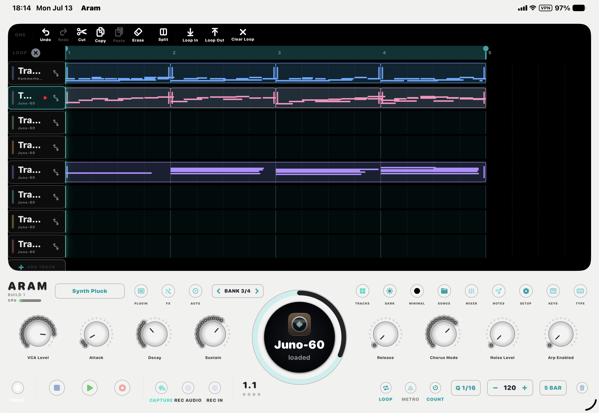

  <h1>A R A M</h1>
  
A recording studio that thinks it's a piece of hardware. 
  iPad · iPhone · Apple&nbsp;Silicon Mac

  
<b>Plays like tape</b>Hit record and play — the song grows as long as you do. No bar counts, no project setup, no click unless you ask.

  
<b>Always listening</b>Noodled something good before you hit record? CAPTURE turns the last thing you played into a loop — tempo detected, already rolling.

  
<b>Hardware first</b>Plug in a MiniLab, KeyLab, Keystage, Launchkey, or almost anything with knobs — screens, LEDs, and encoders just light up and work. Or map any control to anything with MIDI Learn.

  
<b>Sound out of the box</b>A Juno-60-style synth and a deep-space reverb ship built in — plus every AUv3 instrument and effect on your iPad, hosted with per-plugin latency compensation.

  
<b>A real DAW</b>Multitrack MIDI + audio, waveform clips, FX chains, automation, a mixer, a piano roll — sample-accurate, on a timeline that grows to fit.

  
<b>Yours everywhere</b>Songs live in iCloud and open on iPad, iPhone, and Mac. Each song even remembers the theme and control bindings it was made with.

> ARAM is a personal project, installed directly — it is not on the App Store. The manual below is the whole app; scroll on.

---

